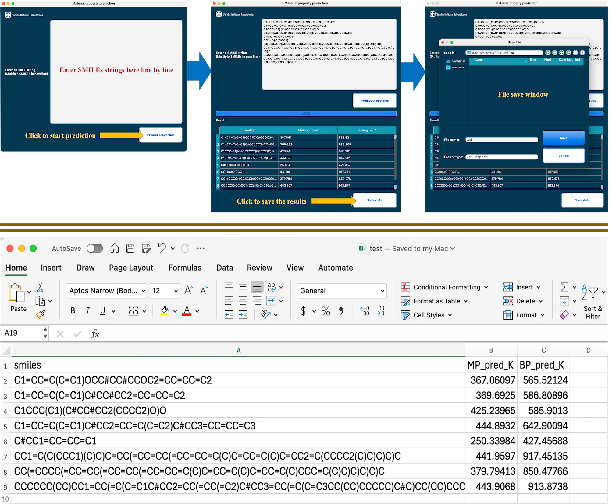

# P2MAT — Material Property Prediction Tool

P2MAT is a desktop GUI application that predicts thermophysical properties of
chemical compounds from SMILES strings using pre-trained machine learning
models.  The interface is built with [PyQt5](https://pypi.org/project/PyQt5/).

**Predicted properties**

| Property | Unit | Model |
|---|---|---|
| Melting Point | K | Stacking ensemble (LightGBM + XGBoost + ExtraTrees + DNN → Ridge) |
| Boiling Point | K | Gradient boosting |
| Heat Capacity | J/K | Gradient boosting |
| Heat of Hydrogenation | — | Gradient boosting |
| H₂ Uptake | mol H₂ | Rule-based (bond saturation) |

---

## Table of Contents

- [System Requirements](#system-requirements)
- [Installation — macOS](#installation--macos)
- [Installation — Windows](#installation--windows)
- [Installation — Linux](#installation--linux)
- [Running P2MAT](#running-p2mat)
- [Usage](#usage)
- [Troubleshooting](#troubleshooting)
- [Limitations](#limitations)

---

## System Requirements

| | macOS | Windows | Linux |
|---|---|---|---|
| **OS** | macOS 12.0 (Monterey) or later | Windows 10 64-bit (build 1903+) or Windows 11 | Debian 11 / Ubuntu 20.04 / Fedora 36 or equivalent |
| **CPU** | Apple Silicon (M1 / M2 / M3 / M4) | x64 (Intel or AMD) | x86\_64 or aarch64 |
| **RAM** | 8 GB minimum | 8 GB minimum | 8 GB minimum |
| **Disk** | ~3.5 GB | ~4 GB | ~4 GB |
| **Internet** | Required on first install | Required on first install | Required on first install |
| **Java** | Installed automatically | Installed automatically | Installed automatically |
| **Python** | Managed by installer (Miniconda, Python 3.12) | Managed by installer (Miniconda, Python 3.12) | Managed by installer (Miniconda, Python 3.12) |
| **Display** | Required | Required | Required (X11 or Wayland) |

---

## Installation — macOS

### Step 1 — Download the DMG

Download `P2MAT-v1.0.0-macOS-arm64.dmg` from the Releases page.

### Step 2 — Open the disk image

Double-click the `.dmg` file. A Finder window opens showing:

```
📁 P2MAT        📄 install.command        📄 README.txt
```

### Step 3 — Run the installer

**Double-click `install.command`.**

If macOS shows _"install.command cannot be opened because it is from an
unidentified developer"_:

1. Right-click `install.command` → **Open**
2. Click **Open** in the confirmation dialog

A Terminal window opens. Press **ENTER** when prompted to start.

### Step 4 — What the installer does

The installer handles every prerequisite automatically:

| Stage | Action | Time |
|---|---|---|
| System check | Confirms macOS 12+ and Apple Silicon | < 1 s |
| Homebrew | Installs Homebrew if not present (may ask for your password) | 0–5 min |
| Java | Installs OpenJDK via `brew install openjdk` (needed by PaDEL) | 0–3 min |
| Miniconda | Downloads and installs Miniconda3 if no conda is found | 1–3 min |
| Python environment | Creates the `qsai` conda environment with all packages | 5–15 min |
| Application | Copies files to `~/Applications/P2MAT/` and creates `/Applications/P2MAT.app` | < 30 s |

The entire process takes **10–20 minutes** on the first install.

### Step 5 — Allow the app (first launch only)

The first time you open P2MAT, macOS Gatekeeper may block it:

1. Open **System Settings → Privacy & Security**
2. Scroll to the Security section and click **Open Anyway** next to P2MAT
3. Click **Open** in the confirmation dialog

This is a one-time step.

### Step 6 — Launch

Open **Finder → Applications** and double-click **P2MAT**, or run from
the terminal:

```bash
source ~/miniconda3/etc/profile.d/conda.sh
conda activate qsai
cd ~/Applications/P2MAT
python p2mat.py
```

### Uninstall (macOS)

```bash
rm -rf /Applications/P2MAT.app ~/Applications/P2MAT
# Optionally remove the Python environment (~2.5 GB):
conda remove -n qsai --all
```

---

## Installation — Windows

### Step 1 — Download the ZIP

Download `P2MAT-v1.0.0-Windows.zip` from the Releases page.

### Step 2 — Extract the archive

Right-click the `.zip` → **Extract All** → **Extract**.

The folder contains:

```
P2MAT-v1.0.0-Windows\
├── P2MAT\                  ← application source and ML models
├── Install-P2MAT.ps1       ← installer script
└── README.txt
```

### Step 3 — Run the installer

**Right-click `Install-P2MAT.ps1` → Run with PowerShell.**

If a blue security dialog appears, click **Run anyway**.

If PowerShell execution policy blocks the script, open PowerShell and run:

```powershell
Set-ExecutionPolicy -ExecutionPolicy RemoteSigned -Scope CurrentUser
```

Then try again.

### Step 4 — What the installer does

| Stage | Action | Time |
|---|---|---|
| System check | Confirms 64-bit Windows 10 build 1903+ | < 1 s |
| Java 21 | Installs Microsoft OpenJDK 21 via `winget` or direct MSI download (UAC prompt may appear) | 1–5 min |
| Miniconda | Downloads and silently installs Miniconda3 for the current user | 2–4 min |
| Python environment | Creates the `qsai` conda environment with all packages | 8–15 min |
| Shortcuts | Copies files to `%LOCALAPPDATA%\P2MAT\`, creates Desktop and Start Menu shortcuts | < 5 s |

Press **ENTER** when prompted to begin. The full process takes **15–25 minutes** on
the first install.

### Step 5 — Launch

Double-click the **P2MAT** shortcut on your Desktop or search for it in the
Start Menu.

Alternatively, run manually from a Command Prompt:

```batch
%LOCALAPPDATA%\P2MAT\P2MAT.bat
```

### Alternative: Inno Setup wizard installer

If you received `P2MAT-v1.0.0-Windows-x64-Setup.exe`, double-click it and
follow the guided wizard. It runs the PowerShell installer in the background
and takes 10–20 minutes.

### Uninstall (Windows)

```powershell
powershell -File "%LOCALAPPDATA%\P2MAT\Uninstall-P2MAT.ps1"
# Optionally remove the Python environment (~2.5 GB):
conda remove -n qsai --all
```

---

## Installation — Linux

### Step 1 — Download the tarball

Download `P2MAT-v1.0.0-Linux-x86_64.tar.gz` (or the `aarch64` variant for
ARM) from the Releases page.

### Step 2 — Extract the archive

```bash
tar -xzf P2MAT-v1.0.0-Linux-x86_64.tar.gz
cd P2MAT-v1.0.0-Linux-x86_64
```

The folder contains:

```
P2MAT-v1.0.0-Linux-x86_64/
├── P2MAT/          ← application source and ML models
├── install.sh      ← installer script
└── README.txt
```

### Step 3 — Run the installer

```bash
bash install.sh
```

Press **ENTER** when prompted to begin.

### Step 4 — What the installer does

The installer auto-detects your Linux distribution from `/etc/os-release`:

| Stage | Action | Time |
|---|---|---|
| System check | Confirms Linux x86\_64 or aarch64 and detects the distro | < 1 s |
| Java 17 | Installs OpenJDK 17 via `apt` / `dnf` / `zypper` / `pacman` (password may be required) | 0–3 min |
| Miniconda | Downloads and installs Miniconda3 to `~/miniconda3` if no conda is found | 1–3 min |
| Python environment | Creates the `qsai` conda environment with all packages | 8–15 min |
| Application | Copies files to `~/.local/share/P2MAT/` and writes `p2mat-launch.sh` | < 30 s |
| Desktop launcher | Creates a `.desktop` entry so P2MAT appears in the application menu | < 1 s |

The full process takes **10–20 minutes** on the first install.

Supported distributions: Debian / Ubuntu / Linux Mint, Fedora / RHEL /
AlmaLinux / Rocky Linux, openSUSE, Arch Linux / Manjaro.

### Step 5 — Launch

Search for **P2MAT** in your application menu, or run directly:

```bash
~/.local/share/P2MAT/p2mat-launch.sh
```

If `conda` is not yet on your PATH after a fresh install, source it first:

```bash
source ~/miniconda3/etc/profile.d/conda.sh
~/.local/share/P2MAT/p2mat-launch.sh
```

> **Headless / server note:** P2MAT requires a graphical display.
> On a server without a display, use a virtual framebuffer:
> ```bash
> Xvfb :99 -screen 0 1024x768x24 &
> export DISPLAY=:99
> ~/.local/share/P2MAT/p2mat-launch.sh
> ```

### Uninstall (Linux)

```bash
rm -rf ~/.local/share/P2MAT
rm -f ~/.local/share/applications/p2mat.desktop
# Optionally remove the Python environment (~2.5 GB):
conda remove -n qsai --all
```

---

## Running P2MAT

### Alternative: run directly with `installer.sh`

If you have already installed the `qsai` conda environment, you can use the
shell scripts directly instead of the platform installers above.
`installer.sh` auto-detects the operating system (macOS or Linux) and calls
the correct prerequisite script.

Install prerequisites:

```bash
sh installer.sh prep
```

Launch the application:

```bash
sh installer.sh run
```

Install prerequisites and launch in one step:

```bash
sh installer.sh both
```

> **Windows note:** `installer.sh` is a bash script and does not run on
> Windows natively. Use `Install-P2MAT.ps1` instead.

---

## Usage

### 1. Enter SMILES

Type one SMILES string per line in the input box.

Sample SMILES for testing:

```
C1=CC=C(C=C1)OCC#CC#CCOC2=CC=CC=C2
C1=CC=C(C=C1)C#CC#CC2=CC=CC=C2
C1CCC(C1)(C#CC#CC2(CCCC2)O)O
C1=CC=C(C=C1)C#CC2=CC=C(C=C2)C#CC3=CC=CC=C3
C#CC1=CC=CC=C1
CCO
c1ccccc1
CC(=O)Oc1ccccc1C(=O)O
```

### 2. Select properties

Tick the checkboxes for the properties you want to predict. At least one must
remain checked at all times.

### 3. Predict

Click **Predict properties**. The progress bar advances as each molecule is
processed. Invalid SMILES are listed above the results table.

### 4. Export

Click **Save data** to export the results table as a CSV file.

### GUI overview



---

## Troubleshooting

| Problem | Fix |
|---|---|
| App does not open (macOS) | Check `~/Library/Logs/P2MAT/p2mat.log` |
| App does not open (Windows) | Run `P2MAT.bat` from a Command Prompt to see the error |
| App does not open (Linux) | Check `~/.local/share/P2MAT/logs/p2mat.log` |
| `No module named 'lightgbm'` | `conda activate qsai && pip install lightgbm` |
| `No module named 'torch'` | `conda activate qsai && pip install torch` |
| `PaDEL-Descriptor timed out` | Verify Java is installed: `java -version`. macOS: `brew install openjdk`. Linux: install `openjdk-17-jdk` |
| Gatekeeper blocks P2MAT (macOS) | System Settings → Privacy & Security → **Open Anyway** |
| Execution policy error (Windows) | `Set-ExecutionPolicy RemoteSigned -Scope CurrentUser` in PowerShell |
| No display / `cannot connect to X server` (Linux) | Use Xvfb: `Xvfb :99 -screen 0 1024x768x24 & ; export DISPLAY=:99` |
| `sudo` password required during install (Linux) | Expected — Java installation needs the system package manager |
| `conda: command not found` after install (Linux/macOS) | Run `source ~/miniconda3/etc/profile.d/conda.sh` then open a new terminal |
| Slow first prediction | Normal — PaDEL JVM starts up once per session; subsequent predictions are faster |

---

## Limitations

- The macOS build supports **Apple Silicon only**. An Intel Mac build requires
  retraining the Melting Point DNN on x86 hardware.
- The Linux build supports **x86\_64 and aarch64** architectures. Other
  architectures are not currently tested.
- Prediction accuracy depends on how similar the input molecule is to the
  training data. Extrapolation outside the training domain may give unreliable
  results.
- Very large or heavily branched molecules may exceed PaDEL's per-molecule
  timeout. Try processing them individually.
- P2MAT requires a graphical desktop environment. It is not designed for
  headless server use, though a virtual display (`Xvfb`) can be used as a
  workaround on Linux.
- Tested on macOS 12–15 (Apple Silicon), Windows 10/11 (x64), and
  Ubuntu 22.04 / Fedora 40 (x86\_64).
