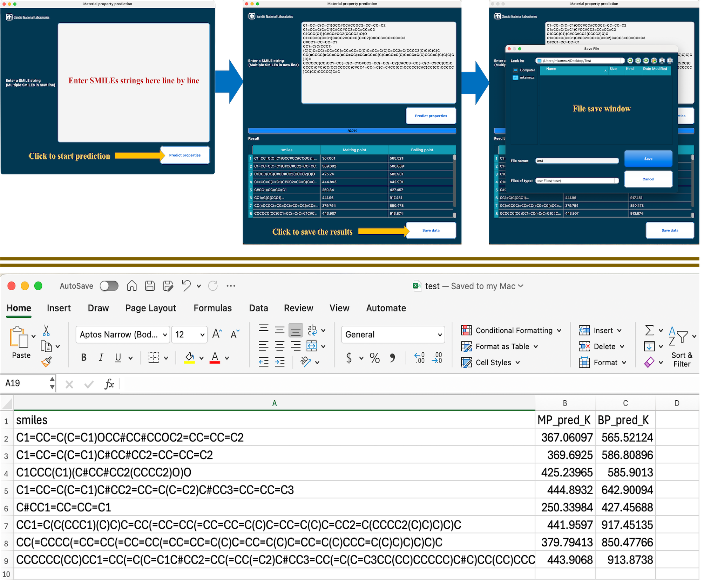

# P2MAT - A python based user interface to predict melting point and boiling point of chemical compounds.

---

P2MAT is a GUI that enable user to input SMILEs strings of chemical compounds to predict melting point and boiling point. A pretrained machine learming model is used for the prediction. The core UI is built using [PyQt5](https://pypi.org/project/PyQt5/).

---

**Table of Contents**

- [P2MAT](#p2mat)
  * [Set Up](#set-up)
    + [Environment](#environment)
      - [Conda](#conda)
    + [SSH](#ssh)
  * [Usage](#usage)
    + [Examples](#examples)
      - [Sample SMILEs](#sample-smiles)
      - [GUI Description](#gui-description)
  * [Limitations](#limitations)

---

## Set up

Note that for MacOS this software can be installed directly using the `P2MAT.dmg` file provided with this release. For this `Xcode` and, `java runtime environment` is required. Follow the steps below for the alternative method.

### Environment

This python based software requires python `>=12.3`, `Xcode` and, `java runtime environment`. 

#### Conda

A conda software requires to setup environments to run this software. Either [anaconda](https://www.anaconda.com/download) or [mini-conda](https://docs.anaconda.com/miniconda/miniconda-install/) can be installed to the system.

### SSH

Open termial and run the following script to install all the required packages under a conda environment named `qsai`:

```bash
sh qsai_install.sh
```

Open `command.sh` file to change the CONDA_BASE_DIR location based on your system.

```bash
CONDA_BASE_DIR=Place your conda location here.
```

Execute the following command form terminal to start the GUI.

```bash
sh command.sh
```

## Usage

### Examples
The workflow of P2MAT software is shown below with an examples.

#### Sample SMILEs
The following sample SMILEs are given for testing perpose.

```chem
C1=CC=C(C=C1)OCC#CC#CCOC2=CC=CC=C2
C1=CC=C(C=C1)C#CC#CC2=CC=CC=C2
C1CCC(C1)(C#CC#CC2(CCCC2)O)O
C1=CC=C(C=C1)C#CC2=CC=C(C=C2)C#CC3=CC=CC=C3
C#CC1=CC=CC=C1
CC1=C(C(CCC1)(C)C)C=CC(=CC=CC(=CC=CC=C(C)C=CC=C(C)C=CC2=C(CCCC2(C)C)C)C)C
CC(=CCCC(=CC=CC(=CC=CC(=CC=CC=C(C)C=CC=C(C)C=CC=C(C)CCC=C(C)C)C)C)C)C
CCCCCC(CC)CC1=CC(=C(C=C1C#CC2=CC(=CC(=C2)C#CC3=CC(=C(C=C3CC(CC)CCCCC)C#C)CC(CC)CCCCC)C#CC4=CC(=C(C=C4CC(CC)CCCCC)C#C)CC(CC)CCCCC)CC(CC)CCCCC)C#C
```

#### GUI Description



## Limitations
We tested our software on MacOS. We will test on other OS soon.
