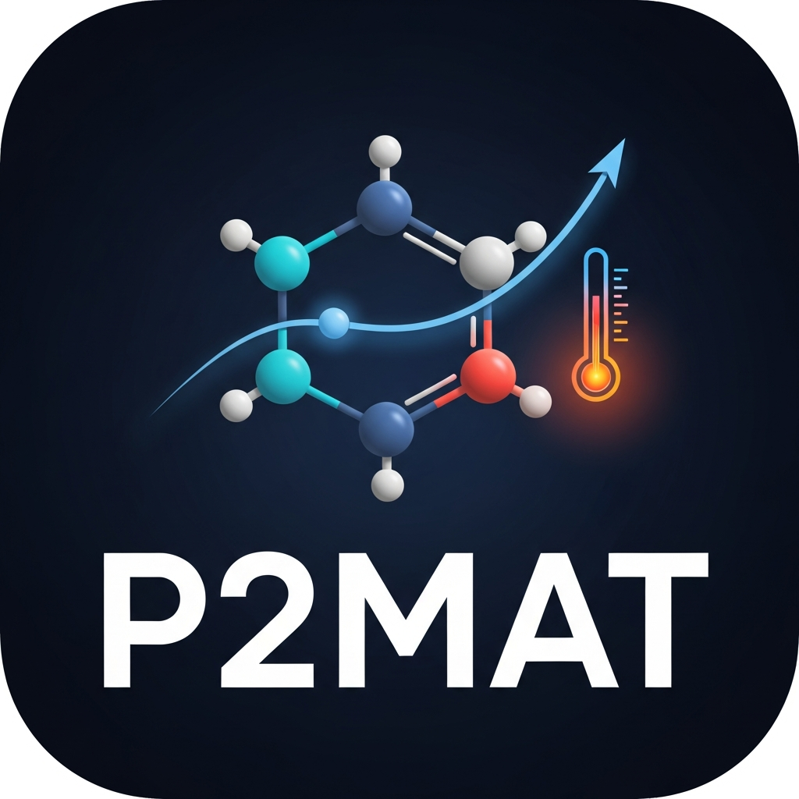

<div align="center">
  
  <h1>P2MAT — Material Property Prediction</h1>
  <p>
    A QSAR-based desktop application for predicting thermophysical properties of chemical compounds directly from their SMILES representation, powered by stacking ensemble models (LightGBM · XGBoost · ExtraTrees · DNN).
  </p>
</div>

---

## Repository Layout

```
P2MAT/
├── ModelTrain/                  # ML model training pipelines
│   ├── Boiling point/           # Boiling point model
│   │   └── Data/                # CSVs — large files split for GitHub; run merge_data.py to restore
│   ├── Melting point 2D/        # Melting point model (2-D descriptors)
│   │   └── Data/                # CSVs — large files split for GitHub; run merge_data.py to restore
│   └── Melting point 3D/        # Melting point model (3-D descriptors)
│       └── Data/                # CSVs — large files split for GitHub; run merge_data.py to restore
├── P2MAT/                       # Desktop GUI application
│   ├── utils/                   # Prediction, descriptor & helper modules
│   ├── include/                 # Bundled model artifacts & feature lists
│   ├── design/                  # UI assets (CSS, backgrounds, SVGs)
│   └── logo/                    # Application icons
├── Release/                     # Cross-platform packaging scripts
├── bundle_stack.py              # Bundles trained MP models → include/
└── bundle_stack_bp.py           # Bundles trained BP models → include/
```

---

## ModelTrain/

Contains three self-contained training pipelines, each following the same internal structure.  
Each pipeline splits compounds into three elemental domains — **CHO**, **CHON**, and **FULL** — and trains domain-specific models independently.

### `Boiling point/`
Python scripts and datasets for training the **boiling point** prediction model.

| Path | Description |
|---|---|
| `Data/` | Train/test CSV splits for CHO, CHON, and full compound sets |
| `src/` | Core modules: data loader, feature selection, model definitions, trainer, stacking, evaluator, DNN |
| `main.py` | Trains all base learners (LGBM, XGBoost, ExtraTrees, DNN) |
| `stack.py` | Trains the stacking meta-learner on top of base learner predictions |
| `boruta.py` | Boruta feature selection wrapper |
| `shap_analysis.py` | SHAP feature importance analysis |
| `williams_plot.py` | Williams plot for applicability domain assessment |
| `uncertainty_analysis.py` | Prediction uncertainty estimation |
| `similarity_score.py` | Tanimoto-based training set similarity scoring |
| `outlier_detection.py` | Outlier identification in training data |
| `retrain_cleaned.py` | Retraining on the cleaned (outlier-removed) dataset |
| `results/` | LaTeX source and figures for the manuscript |

### `Melting point 2D/`
Python scripts and datasets for training the **melting point** prediction model using **2D molecular descriptors** (RDKit).  
Structure mirrors `Boiling point/` with the addition of `dataset_similarity.py`, `methodology_diagram.py`, and `schematic_diagram.py` for paper figures.

### `Melting point 3D/`
Same as `Melting point 2D/` but trained using **3D conformer-based descriptors** (Mordred/RDKit 3D).  
Useful for comparing 2D vs. 3D descriptor performance on the same melting point dataset.

---

## P2MAT/

The **desktop GUI application** built with PyQt5. Users enter SMILES strings, select properties to predict, and get results in a table that can be exported to CSV.

| Path | Description |
|---|---|
| `p2mat.py` | Main application entry point — launches the GUI |
| `utils/worker.py` | Background prediction thread (keeps UI responsive) |
| `utils/stacking_predictor.py` | `StackingPredictor` inference class used at runtime |
| `utils/descriptor.py` | Molecular descriptor computation |
| `utils/mspp.py` | Descriptor preprocessing and domain routing (CHO / CHON / FULL) |
| `utils/dnn_model.py` | DNN architecture for inference |
| `utils/smile.py` | SMILES parsing and validation |
| `utils/depictsmile.py` | 2D structure depiction from SMILES |
| `utils/helper.py` | Shared utility functions |
| `include/best_models/MP/` | Bundled stacking ensemble `.sav` files for melting point |
| `include/best_models/BP/` | Bundled stacking ensemble `.sav` files for boiling point |
| `include/feature/` | Selected feature name lists for each domain and property |
| `design/` | UI stylesheet (`myapp.css`), background images, and design assets |
| `logo/` | Application logo (`logo.png`, `logo.icns`) |


---

## Release/

Cross-platform packaging scripts for distributing P2MAT to end users.

| Platform | Files | Description |
|---|---|---|
| `macOS/` | `build_dmg.sh`, `install.command` | Builds a `.dmg` installer for macOS |
| `linux/` | `build_tarball.sh`, `install.sh` | Builds a `.tar.gz` bundle for Linux |
| `windows/` | `P2MAT.iss`, `Install-P2MAT.ps1` | Inno Setup installer for Windows |

See `Release/README.md` for platform-specific build instructions.
